# Club Management System — Architecture

> **Tech stack:** Java 25 · Spring Boot 4.0.7 · Spring for GraphQL · Spring AI 2.0 · Keycloak 26 · JPA/Hibernate 7 · Flyway · H2 (dev) · PostgreSQL 16 (prod)

> **Identity model:** Keycloak is the **single source of truth for member identity** (name, email, phone, membership dates). The `member` table is a lean, PII-free join stub. See [§7 Member Identity](#7-member-identity--keycloak-as-source-of-truth).

---

## 1. System Context

Who talks to what at the highest level.

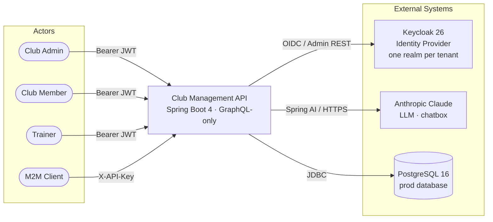

---

## 2. Multi-Tenant Identity Model

Three clubs, three Keycloak realms, one Spring Boot application.

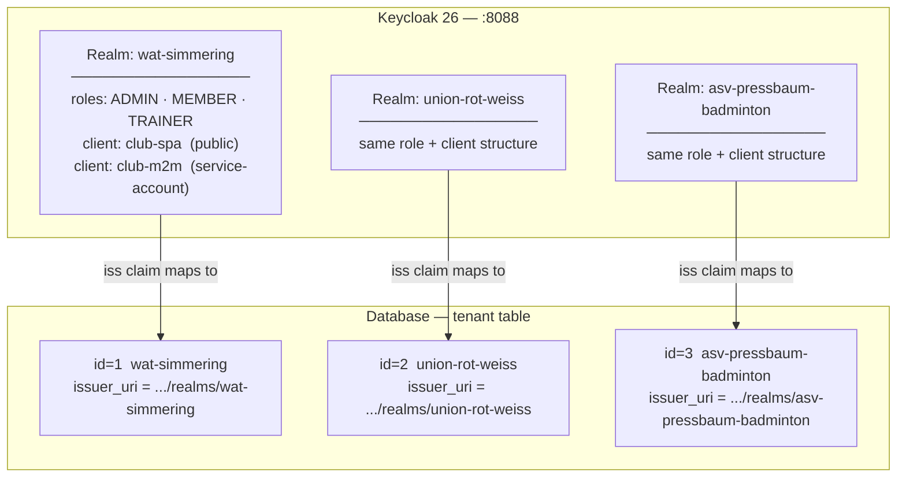

---

## 3. Request Lifecycle — Human Login (JWT path)

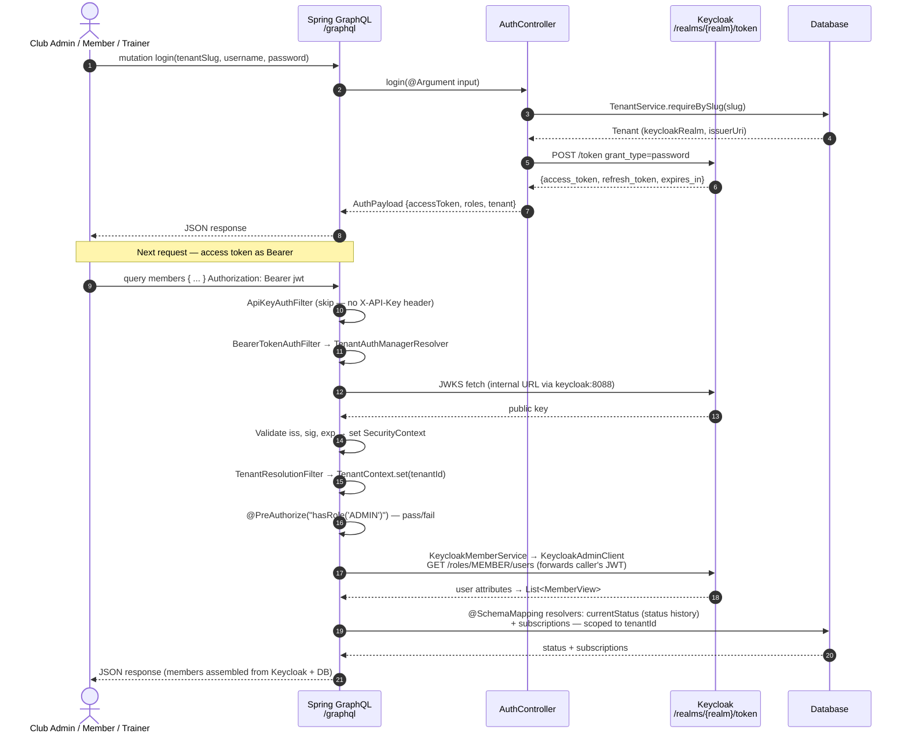

> **Note:** member reads no longer hit the `member` table — identity comes from Keycloak's Admin REST API (`GET /admin/realms/{realm}/roles/MEMBER/users`). Only the *current status* and *subscriptions* are resolved from the database. See [§7](#7-member-identity--keycloak-as-source-of-truth).

---

## 4. Request Lifecycle — M2M API Key path

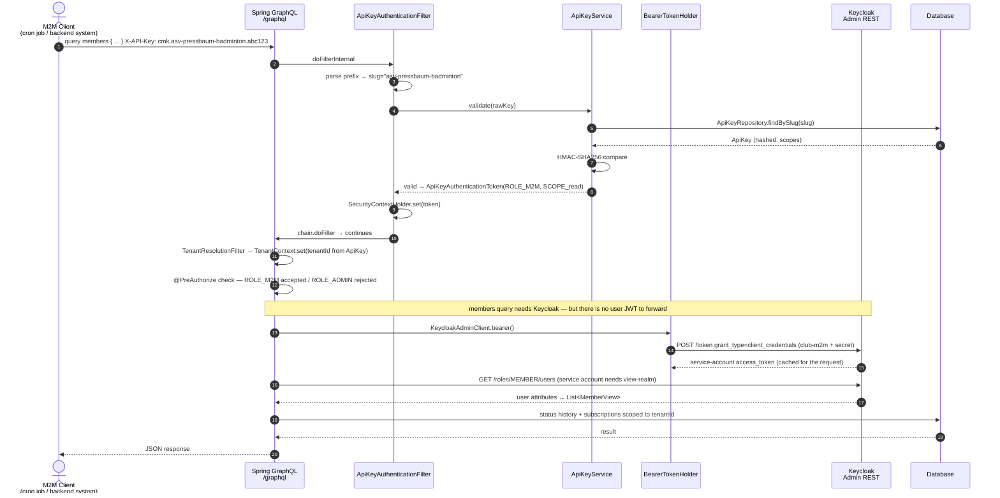

> **M2M token fallback:** API-key callers have no user JWT, so any operation that calls the Keycloak Admin REST API (e.g. `members`) obtains a **service-account token** via the per-tenant `club-m2m` client-credentials grant. The secret lives in `tenant.m2m_client_secret` (Flyway **V9**); `BearerTokenHolder` caches the token per request. The service account must hold the realm-management roles `view-users`, `manage-users`, **and `view-realm`** — the last is required because members are listed via the `/roles/{role}/users` endpoint. These roles are granted idempotently by `scripts/data_loader.sh` (realm-import JSON does not reliably apply roles to auto-created service-account users).

---

## 5. Security Filter Chain

Filters execute in this order on every `/graphql` request.

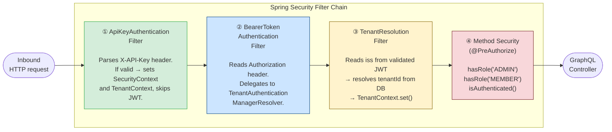

---

## 6. Spring AI Chatbox Flow

The natural-language assistant reads club data via `@Tool`-annotated wrappers — it never writes.

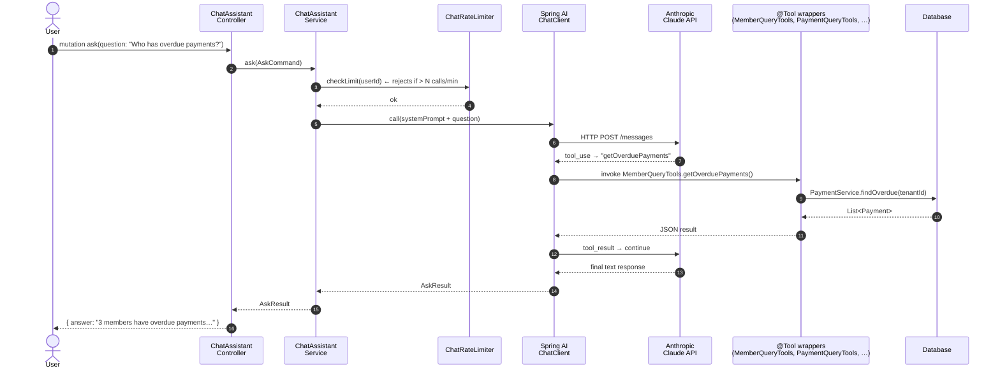

---

## 7. Member Identity — Keycloak as Source of Truth

Member identity moved out of the database and into Keycloak (Flyway **V8**). The `member` table is now a lean, **PII-free** join stub; all personal data — name, email, phone, and membership dates — lives on the Keycloak realm user and is read back through the Admin REST API into a `MemberView` read model.

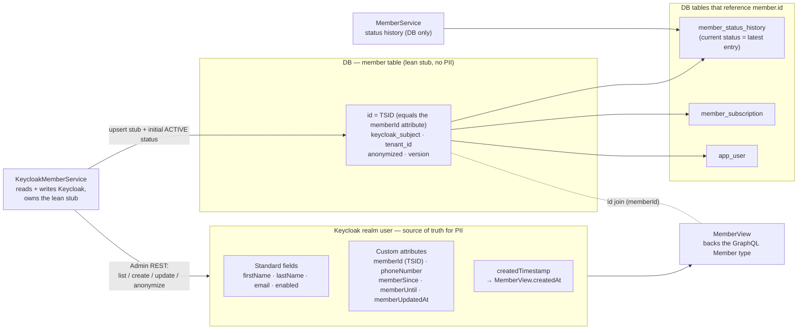

**Read / write split**

| Concern | Owner | Storage |
|---|---|---|
| Name, email, phone, membership dates, account enabled | `KeycloakMemberService` → `KeycloakAdminClient` | Keycloak user (standard fields + custom attributes) |
| Stable member id (TSID), Keycloak link, tenant scope, GDPR flag | `KeycloakMemberService` (upserts the stub) | `member` table |
| Current status + status history | `MemberService` | `member_status_history` (status derived from the latest row) |
| Read projection for GraphQL | `MemberView` | assembled from Keycloak + DB, joined on `member.id == memberId` |

**Key points**

- **`Member` carries no PII and no `@TsidGenerated`.** Its `@Id` is *assigned* from the Keycloak `memberId` attribute (a TSID minted by `KeycloakMemberService.createMember`), so the database id and the Keycloak identity always agree. The stub exists only as an FK target for `member_status_history`, `member_subscription`, and `app_user`.
- **GDPR erasure** scrubs name/email and disables the account in Keycloak (keeping only `memberId`), then flips the stub's `anonymized` flag — which replaced the former `firstName == "DELETED"` sentinel that `GdprPurgeJob` used.
- **Custom-attribute naming gotcha:** the "last updated" attribute is `memberUpdatedAt`, **not** `updatedAt` — Keycloak reserves `updated_at` for an internal epoch-integer claim, and an ISO-8601 string there breaks ROPC token issuance.
- **Realm-import fixtures** must carry an explicit `createdTimestamp`; Keycloak does not auto-populate it on import and treats it as read-only afterwards. Because `Member.createdAt` is a non-null `DateTime!` sourced from Keycloak, one fixture missing the timestamp fails the entire `members` query.

---

## 8. Domain Layer Map

How the domain packages relate to each other.

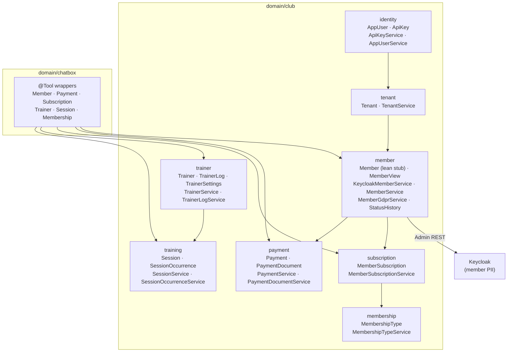

> **Cross-cutting (omitted above for clarity):** every entity extends `Auditable` from `domain/support` (provides `createdAt`, `updatedAt`, `tenantId`); every service may throw typed exceptions from `domain/club/exception/`, mapped to GraphQL errors in `GraphQlExceptionAdvice`.

---

## 9. Infrastructure Layer Map

### 9a. Security wiring

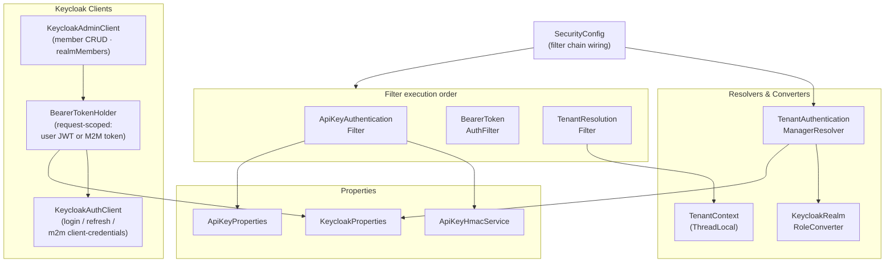

### 9b. Controllers & scheduling

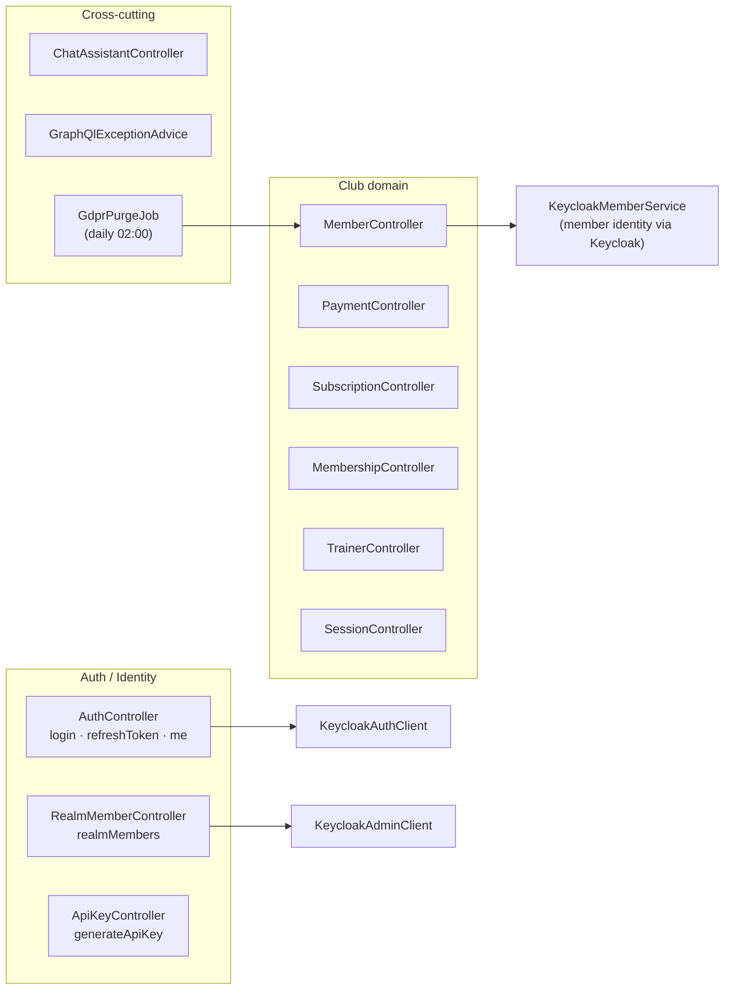

---

## 10. Devcontainer Topology

What runs where when `docker compose up` starts.

> Inside the devcontainer, Keycloak is reachable at `http://keycloak:8088` (Docker DNS) — **not** `localhost:8088`. Keycloak auto-imports the three realm JSONs on startup (`start-dev --import-realm`). After the app is up, `scripts/data_loader.sh` (a) grants the `club-m2m` service account the `view-users` / `manage-users` / `view-realm` realm-management roles in all three realms, (b) seeds members/trainers/subscriptions, and (c) writes fresh API keys to `scripts/keycloak-credentials.txt` (regenerated every run).

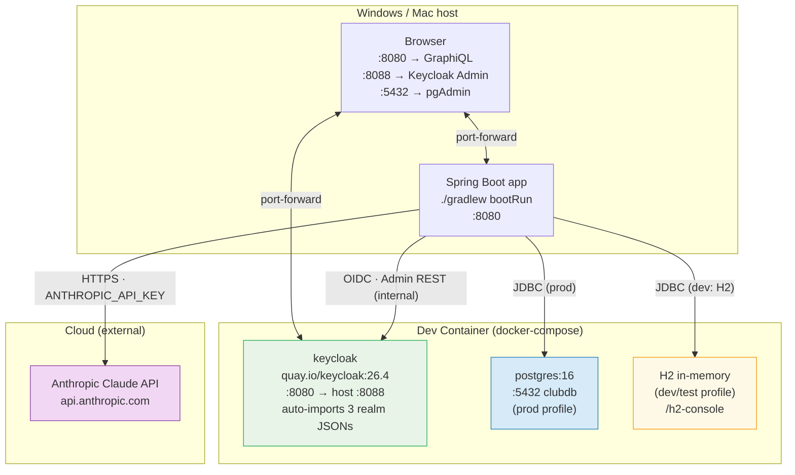

---

## 11. GraphQL Schema Surface

A bird's-eye view of every query and mutation, grouped by domain.

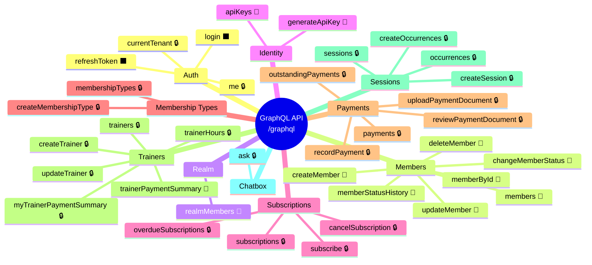

> **Legend:** ⬛ public (no token required) · 🔒 any authenticated role · 👑 ADMIN only

---

## Key Design Decisions

| Decision | Rationale |
|---|---|
| **GraphQL-only** (no REST) | Single endpoint; per-operation authorization via `@PreAuthorize`; no URL routing complexity |
| **One Keycloak realm per tenant** | Strict isolation; no cross-tenant token leakage possible at the IdP level |
| **JWT issuer → tenant resolution** | The `iss` claim carries the realm URL, which maps 1-to-1 to a `Tenant` row — no separate tenant header needed |
| **API keys for M2M** | Avoids OAuth client-credentials complexity for cron jobs / backend calls; keys are HMAC-validated, never stored in plaintext |
| **Keycloak is the single source of truth for member identity** | Name, email, phone and membership dates live on the Keycloak user (standard fields + custom attributes); the `member` table holds no PII. One identity store, no duplication, GDPR erasure happens at the IdP |
| **Bearer-token forwarding + M2M fallback for Admin REST** | JWT callers forward their own token to the Keycloak Admin API. API-key (M2M) callers have no user JWT, so `BearerTokenHolder` obtains a `club-m2m` client-credentials service-account token instead — no long-lived admin credentials baked into the app |
| **`member` table kept as a lean FK stub** | It holds only the TSID (= Keycloak `memberId`), the Keycloak link, tenant scope, and the `anonymized` flag — the stable join target for status history, subscriptions, and `app_user`, none of which Keycloak models |
| **Spring AI `@Tool` wrappers are read-only** | The chatbox assistant can only observe state, never mutate it — architectural safety boundary |
| **TSID IDs** | Time-sorted, 64-bit, k-sortable — no UUID fragmentation, no sequence contention across tenants |
